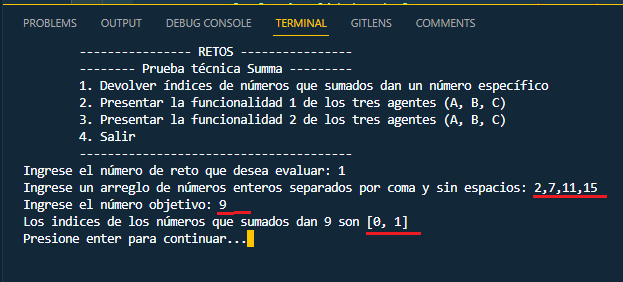
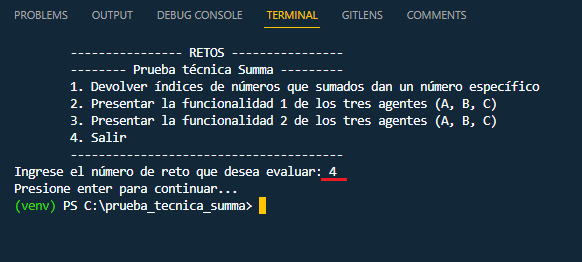

# Prueba Técnica Summa #
Este repositorio está pensado para almacenar y presentar la prueba técnica para la vacante de Gestor Soluciones - Junior en la empresa Summa
 

## ¿Cómo acceder a la solución de la prueba técnica? ##

Para acceder a la solución se debe abrir una consola en un sistema operativo que cuente con Python 3.9 o superior.  
 

Una vez cargada la carpeta del proyecto hacer llamado al archivo llamado 'consola.py', el cual mostrará en pantalla la presentación de los retos de una manera visual  
 

### Solución de la parte 1 del reto técnico ###
Al ingresar el número correspondiente a la solución de la parte 1 del reto técnico, se debe ingresar en primer lugar una secuencia de números enteros separados por coma y sin espacios que será el arreglo de número en el cual se quiere evaluar la suma objetivo. En segundo lugar, se debe ingresar el valor de la suma objetivo que se desea. 
En el caso en que por accidente se ingrese en cualquiera de los campos un caracter que no sea un número, se mostrará la siguiente recomendación: 
 
Al presionar la tecla enter, el programa se recargará y volverá a mostrar la consola de retos (pantalla principal). 

Si se ingresa una suma objetivo que no sea posible conseguir mediante la suma de 2 de los elementos del arreglo, el programa presentará el siguiente mensaje:  
 

Al ingresar un valor que sea posible, como el que se muestra en el siguiente ejemplo, el programa devolverá una única respuesta: 
 

### Solución de la parte 2 del reto técnico ###
#### Funcionalidad 1 ####
Para visualizar la solución, en la pantalla principal el usuario debe ingresar el número 2 y posteriormente una lista de números reales como se muestra en el ejemplo 
 
El programa retornará para la media aritmética para el agente A, la media armónica para el agente B y la mediana para el agente C. 
La solución de este reto hace uso de la librería 'statistics' que está integrada en Python. 
 

Como una segunda alternativa, se incluye en el proyecto un archivo llamado 'parte2a.py' que contiene la solución al mismo reto pero que no hace uso de la librería estadística. Por defecto el programa está diseñado para que use la solución que implementa la librería de estadística. Si se desea usar la función que no la usa, en el archivo 'consola.py', en la linea 3 se debe cambiar "parte2" por "parte2a".  
 

#### Funcionalidad 2 ####
Para visualizar la solución, en la pantalla principal el usuario debe ingresar el número 3 y posteriormente un número entero entre 1 y 99 como se muestra en el ejemplo 
El programa retornará las escaleras para cada agente con su respectiva identificación y separadas entre ellas por una línea como se puede observar a continuación: 
 

En caso en que el usuario introduzca un número que no está en el rango entre 1 y 99, o introduzca o un caracter que no sea un número entero, el programa presentará la advertencia correspondiente: 
 
 

Finalmente, al regresar a la pantalla principal e introducir el número 4, el programa pedirá que se confirme la acción presionando la tecla enter y posteriormente se cerrará como se muestra en la siguiente imagen 
 
